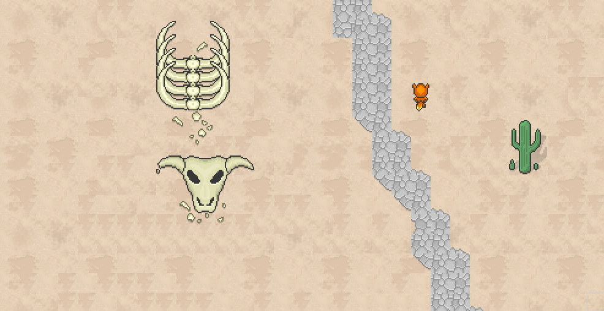
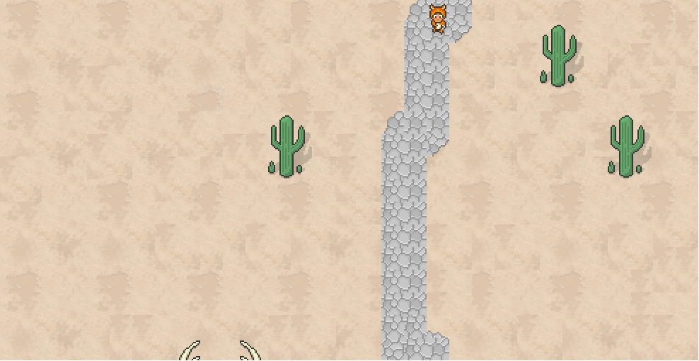
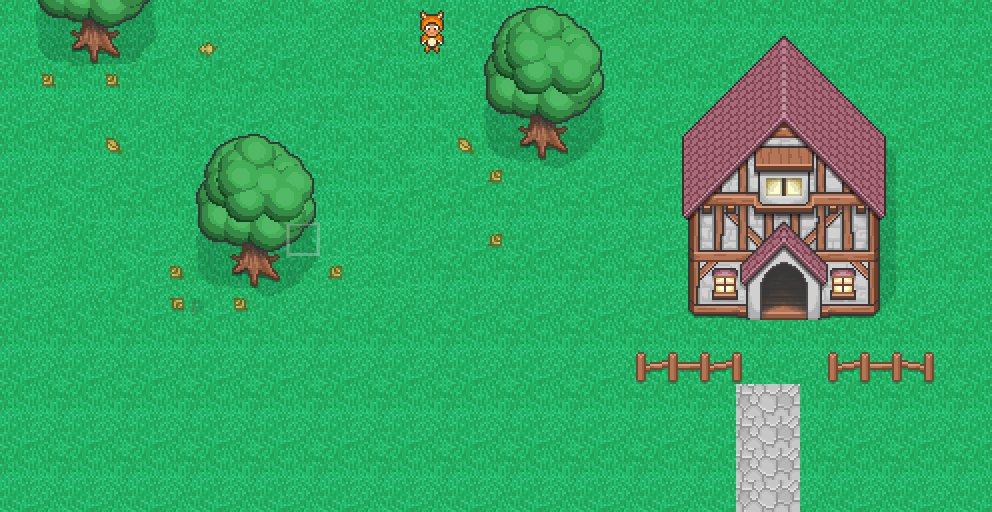
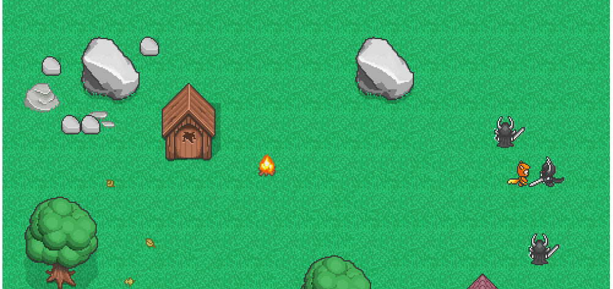

A simple RPG game built for the web.

RPG Game
=================

For lack of a better name, this is my RPG game. Its a web-based, scalable, multiplayer rpg game. And perhaps someday it will be defined as an mmorpg. This game is running on ***nodejs*** and ***mongodb*** for the serverside, it uses ***websockets*** for communication, and takes advantage of ***underscore***, ***jquery*** and ***requirejs***. I'm using ***tiled map editor*** for making my maps, and a homebrewed spritesheet & tilesheet editor found in the tools folder. Development testing is done almost entirely in Google Chrome for Linux; so if you have anything else than that, be ready for bugs :)  The game is running 24/7 on AWS.

Play now
------------

The game is under heavy active development, and will not be playable until the end of summer 2014. However you are free to test the current functionality of the game over at, [myquest](http://jbud.me/playground/myquest)

Client/Server
-----------------

The game can be split between its client and server portions. However, the primary benefit in using nodejs is the reusability of scripts between client and server side. Obviously there must be some differences between client/server side versions of the scripts, so a little extension script was built to extend objects into their client/server counterparts. This is done by injecting a server/client-specific model of the object into the object itself at runtime.

Event Handling
---------------

This game makes heavy use of event handling (aka the observer pattern). Essentially an object is able to attach a listener to another object to listen for certain events it may invoke (eg. a character listens to its foe invoking the EVT_MOVED event, in case he tries to flee from battle). When an event is invoked, it checks which observers are listening to it, and triggers those observers to handle their callbacks. Those observers will either queue their callback for the next most suitable time, or handle the callback immediately if necessary.

Screenshots
-----------

***WARNING***: Only tested under ***Google Chrome*** so far

